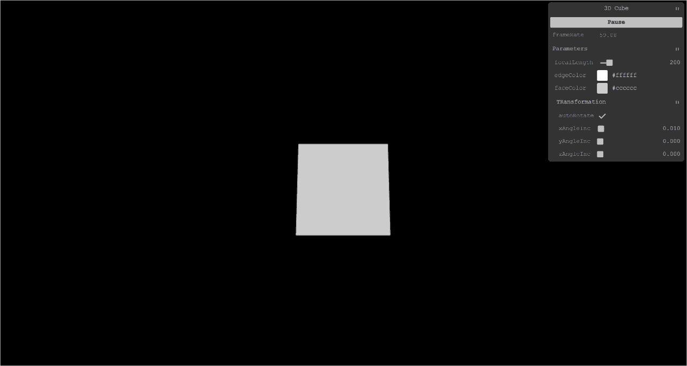
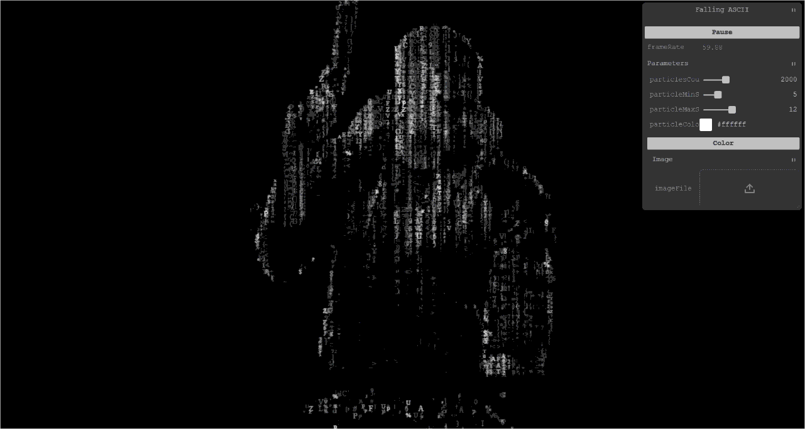
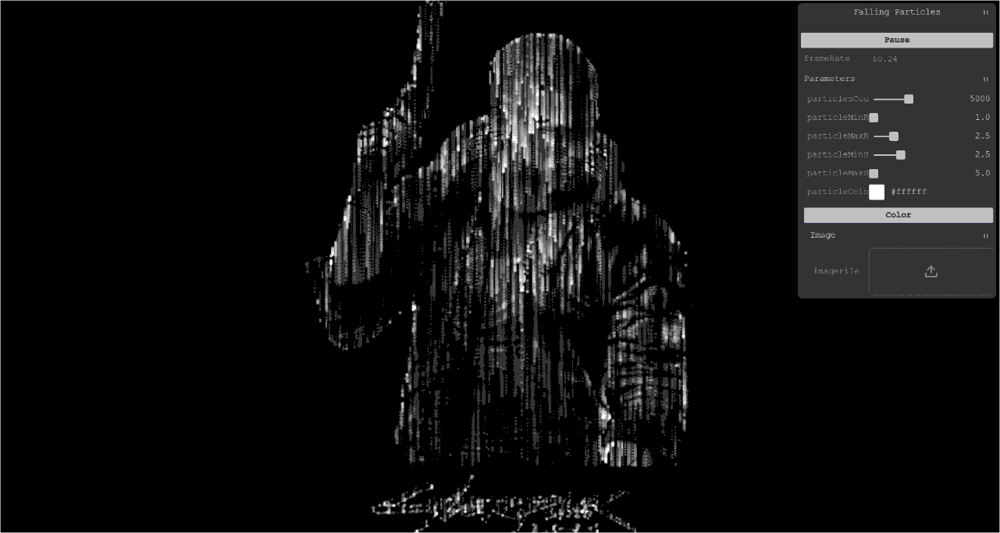
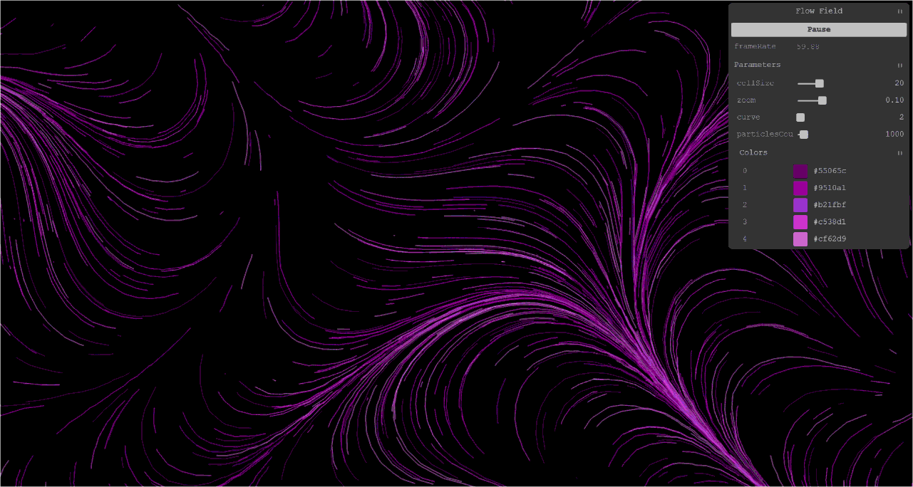
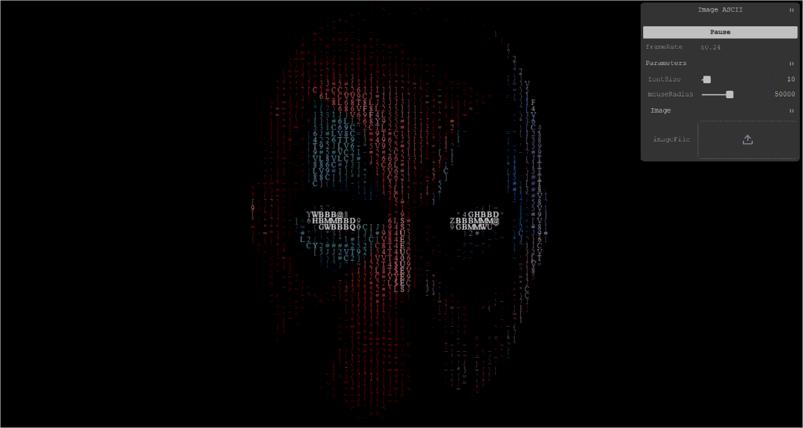
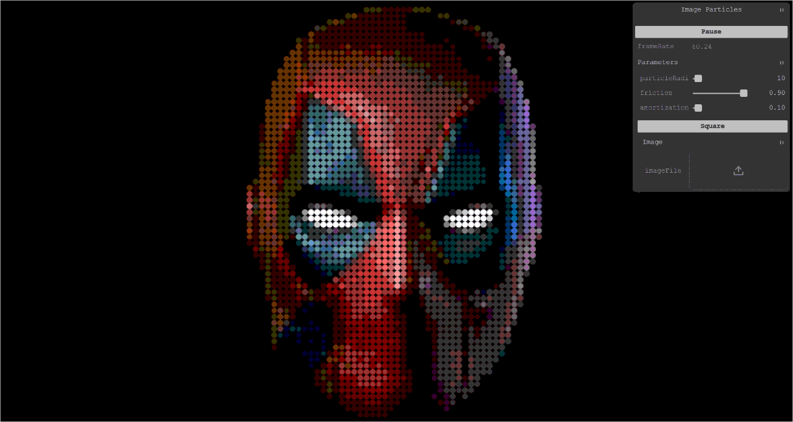
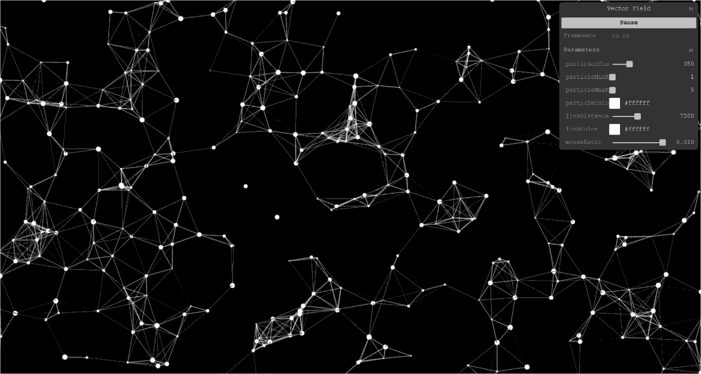
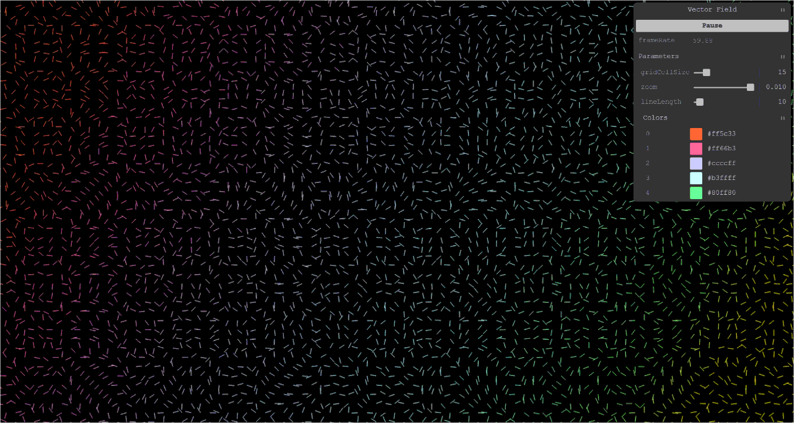

# HTML Canvas Projects

Small projects implemented using HTML Canvas and pure JavaScript

# Projects

## Cube Projection - [demo](https://iulian-stan.github.io/html-canvas-js/cube-projection/)

## Falling ASCII - [demo](https://iulian-stan.github.io/html-canvas-js/falling-ascii/)

## Falling Particles - [demo](https://iulian-stan.github.io/html-canvas-js/falling-particles/)

## Flow Field - [demo](https://iulian-stan.github.io/html-canvas-js/flow-field/)

## Image ASCII - [demo](https://iulian-stan.github.io/html-canvas-js/image-ascii/)

## Image Particles - [demo](https://iulian-stan.github.io/html-canvas-js/image-particles/)

## Linked Particles - [demo](https://iulian-stan.github.io/html-canvas-js/linked-particles/)

## Vector Field - [demo](https://iulian-stan.github.io/html-canvas-js/vector-field/)

